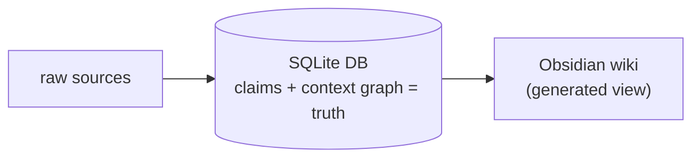
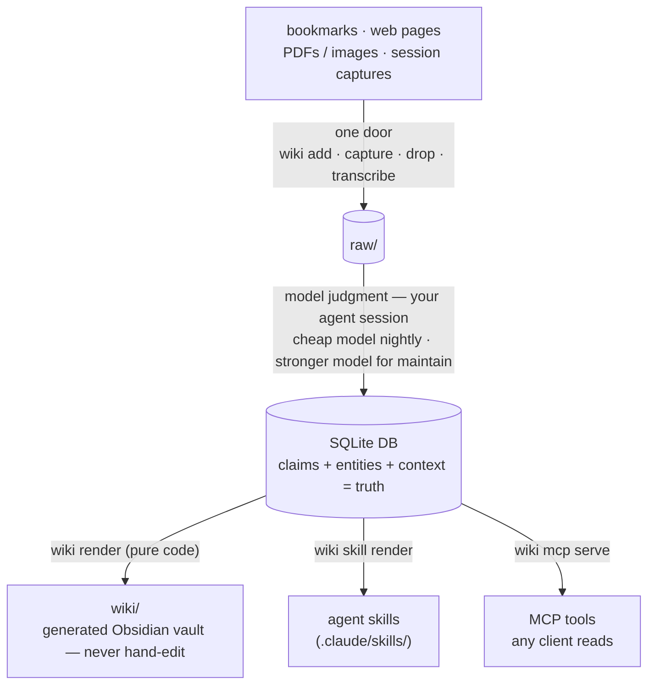

# wiki-brain


A personal, compounding, **agent-native** knowledge base. One SQLite database is
the source of truth; everything else is a regenerable projection of it, rebuilt by
pure code and never hand-edited:



**Key-free by default.** The CLI does pure-code structure (ingest, render, search,
budgeted fetch) with **zero billable LLM calls and no API keys** — judgment lives
in your agent/model sessions, which read content and emit structured claims. An
optional *premium research tier* (Firecrawl / mcp-omnisearch) can be layered in at
the session level, with its keys held outside this repo, so the project itself
stays secret-free (`wiki lint` enforces it).



Knowledge is compiled once at ingest and maintained, never re-derived per query.
The database projects **three ways** — the **Obsidian wiki** to browse, **agent
skills** authored from promoted truth, and an **MCP server** any agent can query —
each rebuilt from the DB, so humans and models change the DB, never the outputs.
Provenance is rigorous: every source artifact is hash-verified, and nothing
becomes truth except through a human-gated promotion. See **BUILD_SPEC.md** for the
full design and **SCHEMA.md** for conventions.

## Design boundaries
- The `wiki` CLI contains **zero model calls** (a billing + determinism
  boundary). All judgment happens inside your agent/model session (the
  `wiki-maintainer` maintenance procedures).
- **Key-free.** No API keys anywhere in the project; headless model children are
  denied in settings, so model work only happens in an interactive agent session.
- The live DB lives at an absolute path outside the tree (default
  `~/.wiki-brain/wiki.db`) so scheduled-task worktrees share one truth.
- **Provenance is enforced.** Every source artifact is hash-verified on the way
  in and again whenever it's filed into `raw/<bucket>/<year>/`; only human-gated
  `promoted` claims ever reach the wiki, the skills, or MCP results.
- **Your knowledge stays local.** This is a code/design repo: `raw/`, `inbox/`,
  `wiki/`, `db/dump.sql`, `config.toml`, and `log.md` are git-ignored, so your
  actual notes never publish. Un-ignore them locally if you want a private repo
  that versions your knowledge too.

> **Harness-neutral, MCP-first.** The CLI is pure code and the MCP server works
> with any MCP client, so any agent can ingest, query, and maintain the brain.
> Two touchpoints are specific to the reference harness used for the judgment
> passes today (Claude Code): authored skills render to `.claude/skills/` (its
> skill directory), and the key-free boundary denies headless model children
> (e.g. `claude -p`) in `.claude/settings.json`. Swap in any MCP-capable agent.

## Setup
```powershell
# from the repo root
Copy-Item config.example.toml config.toml           # then edit paths.db etc.
py -m venv .venv
.venv\Scripts\python.exe -m pip install -e .\cli    # installs the CLI + trafilatura
.venv\Scripts\wiki.exe init                          # create DB + scaffold dirs
```
`config.toml` is git-ignored (it holds your machine-specific paths); the tracked
`config.example.toml` is the template. The live DB lives at an absolute path
**outside** the repo so scheduled-task worktrees share one source of truth.

Optional extras (each guarded — the core CLI runs without them):
`[search]` (robust DuckDuckGo via `ddgs`) · `[docs]` (Docling + Tesseract OCR for
PDFs/images) · `[media]` (YouTube transcripts) · `[semantic]` (local-embedding
search) · `[mcp]` (serve the brain over MCP). E.g. `pip install -e ".\cli[search,docs]"`.
Run the CLI any of these ways:
- `.venv\Scripts\wiki.exe <cmd>` (the installed console script), or
- `.\wiki <cmd>` from the repo root (wrapper → repo venv), or
- add `.venv\Scripts` to PATH, or `pipx install .\cli` into a PATH'd Python so
  scheduled tasks can call a bare `wiki`.

## Quick tour
```powershell
.\wiki add https://example.com/article --origin clip   # one door in
.\wiki drop                                             # ingest files from the drop folder
.\wiki transcribe https://youtu.be/VIDEO_ID            # ingest a video's captions
.\wiki pending                                          # what needs extraction
# (your agent produces extraction JSON per the contract in the docs)
.\wiki file-claims --source 1 --json extract.json
# accepted extraction auto-files the raw artifact into raw/<bucket>/<year>/
# and refreshes raw/INDEX.md so primary evidence remains easy to pull
.\wiki gate                                             # auto-promote the boring tier
.\wiki render ; .\wiki digest                          # rebuild pages + today's digest
.\wiki search "caching" --hybrid                       # keyword + semantic (needs [semantic])
.\wiki lint ; .\wiki health                             # self-check
.\wiki commit "manual ingest"
```
Open the `wiki/` folder as an Obsidian vault to browse (graph view works via
`[[wikilinks]]`).

## Raw evidence filing
Primary sources stay intact and retrievable. After `wiki file-claims` accepts an
extraction, WikiBrain verifies the source hash, moves the raw artifact out of
flat staging into a deterministic bucket, updates `sources.path`, marks the
source page dirty, and refreshes `raw/INDEX.md`.

Buckets are derived from source metadata:
`raw/web/<year>/`, `raw/documents/<year>/`, `raw/images/<year>/`,
`raw/transcripts/<year>/`, `raw/sessions/<year>/`, `raw/datasets/<year>/`, or
`raw/uncategorized/<year>/`. The database `sources` table remains the canonical
index; `raw/INDEX.md` is the human/agent-friendly projection.

Backfill or repair existing evidence with:
```powershell
.\wiki evidence file --all        # file all processed sources + refresh index
.\wiki evidence file --source 12  # file one source
.\wiki evidence index             # rebuild raw/INDEX.md only
```

## Serve the brain over MCP
Expose the knowledge base to any MCP client (any agent or harness) as
tools — a harness-agnostic *query door* beside the Obsidian and skill projections
(BUILD_SPEC §13). Needs the `[mcp]` extra; still **zero model calls, no API keys**.

```powershell
pip install -e ".\cli[mcp]"
.\wiki mcp info                     # prints the client-config JSON to paste in
.\wiki mcp serve                    # run the stdio server (the client launches this)
.\wiki mcp serve --read-only        # omit the brain_capture write tool
```
Tools: `brain_search` (FTS), `brain_hybrid` (FTS+semantic), `brain_graph`,
`brain_recall` (a context pack for the client's model to synthesize from), and
`brain_capture` — the one write, which lands as a **pending** `session/<harness>`
source behind the human gate, exactly like `wiki capture`. Results label promoted
(vetted) vs pending (unvetted); all source text is treated as data, not instructions.

## Tests
```powershell
.venv\Scripts\python.exe tests\acceptance.py
```
Offline harness covering phases 1–7 against a throwaway temp DB (never touches
the live DB). Network paths (URL fetch, websearch, live bookmark fetch) and the
live MCP stdio server (needs the `[mcp]` extra) are exercised separately.

## Scheduled maintenance
Maintenance splits in two: a **zero-model** half (bookmarks sync, gate, render,
lint, health, commit) that is pure code, and a **judgment** half (claim
extraction, synthesis, contradiction adjudication, skill drafting) that needs a
model. Both stay key-free — pick the cadence that fits.

**Hybrid — no agent for the mechanical half.** A plain Windows Task Scheduler job
runs `scripts/mechanical-maintain.ps1` daily (the zero-model steps only, no agent
at all), and you run the judgment half interactively in your agent (the
`maintain.md` procedure) when convenient. The script commits locally and never
pushes — you review the diff.
Register it (runs whether or not you're logged on, no stored password):
```powershell
$repo = "C:\path\to\wiki-brain"
Register-ScheduledTask -TaskName "wiki-brain mechanical maintain" `
  -Action (New-ScheduledTaskAction -Execute powershell.exe `
    -Argument "-NoProfile -ExecutionPolicy Bypass -File `"$repo\scripts\mechanical-maintain.ps1`"") `
  -Trigger (New-ScheduledTaskTrigger -Daily -At 6:30am) `
  -Principal (New-ScheduledTaskPrincipal -UserId "$env:USERDOMAIN\$env:USERNAME" -LogonType S4U) `
  -Settings (New-ScheduledTaskSettingsSet -StartWhenAvailable)
```

**Fully autonomous — a scheduled agent runner.** Point any agent that supports
cron/scheduled runs at the two maintenance procedures (working folder = this repo;
isolated worktree if supported). Use a cheaper model for the nightly pass and a
stronger one for the morning pass:

| Task | ~Time | Model | Procedure |
|---|---|---|---|
| `night-gather` | 02:00 daily | cheaper | `Follow .claude/skills/wiki-maintainer/gather.md exactly.` |
| `morning-maintain` | 06:30 daily | stronger | `Follow .claude/skills/wiki-maintainer/maintain.md exactly.` |

Generated `wiki/` + `db/dump.sql` commit from the worktree branch; fast-forward to
`main` on success. The live DB is shared via its absolute path, so every task sees
the same truth.

> The MCP server can't run these itself — it's a passive tool host with no model.
> The timer and zero-model steps need no agent (Task Scheduler handles them), but
> the judgment half always needs a model-bearing client.

## Cost & keys
The project holds **no API keys** and the CLI makes **no model calls**, so the
repo itself incurs no model spend. Any model cost comes only from the agent
session you choose to run the judgment passes — outside this repo, under whatever
provider or subscription you use. (BUILD_SPEC §10.)

## Using with Claude Code (the reference harness)
wiki-brain is harness-neutral, but **Claude Code** is the reference harness it was
built and tested against: it runs the judgment passes, and the brain's own
`wiki-maintainer` skill lives in `.claude/skills/`. If you drive it with Claude
Code, this is the concrete setup — and the project's original key-free, subscription-only posture.

**The skill.** `.claude/skills/wiki-maintainer/` holds the procedures the model
follows: `gather.md` (night), `maintain.md` (morning / `/maintain`), `capture.md`
(when to call `wiki capture`), `query.md` (answer from the base), and `skills.md`
(author skills from promoted truth). `CLAUDE.md` and `AGENTS.md` are thin pointers to it.

**Subscription-only, no metered API** (BUILD_SPEC §1.5, §10). No API keys exist
anywhere, and `claude -p` / `claude --print` / other headless children are denied
in `.claude/settings.json` — all model work happens inside interactive or
scheduled Claude Code sessions, on the subscription, never the metered API. After
a few days of scheduled runs, check the account usage page; expect **zero
Agent-SDK credit** drawn. If credit *is* drawn, disable the tasks and fall back to
interactive `/maintain`.

**Scheduled Routines.** Two Desktop scheduled tasks via the **Routines** UI
(working folder = this repo, **Isolated worktree** ON):

| Routine | ~Time | Model | Prompt |
|---|---|---|---|
| `night-gather` | 02:00 daily | **Haiku** | `Follow .claude/skills/wiki-maintainer/gather.md exactly.` |
| `morning-maintain` | 06:30 daily | **Sonnet** | `Follow .claude/skills/wiki-maintainer/maintain.md exactly.` |

Haiku does the cheap night gather; Sonnet does the gated morning maintain.

**Authored skills.** `wiki skill approve` renders a skill from promoted claims to
`.claude/skills/<name>/`; `wiki skill install` copies it to `~/.claude/skills/` so
it's active in every Claude Code session. Both are human-gated.

**Live capture & MCP.** In any Claude Code session in this repo, call
`wiki capture --origin claude-code "<finding>"` to file a durable finding (it
enters as pending, faces the morning gate). To wire the brain into Claude Desktop
as an MCP client, `wiki mcp info` prints the snippet for `claude_desktop_config.json`.

## Acknowledgments
wiki-brain builds on ideas from others:

- **Andrej Karpathy's "wiki"** idea for a personal, compounding knowledge base —
  the seed concept of compiling what you learn into a durable, linkable wiki
  instead of re-deriving it per query.
- **Nate B Jones'** video [*Karpathy's Wiki vs. Open Brain*](https://www.youtube.com/watch?v=dxq7WtWxi44)
  and his [newsletter](https://natesnewsletter.substack.com/), which framed the
  move this project is built around: **pairing the Karpathy-style wiki with a
  database** as the source of truth, so the wiki becomes a generated projection.

The architecture here — raw sources → SQLite (the truth) → a generated Obsidian
wiki — is a direct take on that database-backed-wiki idea.
